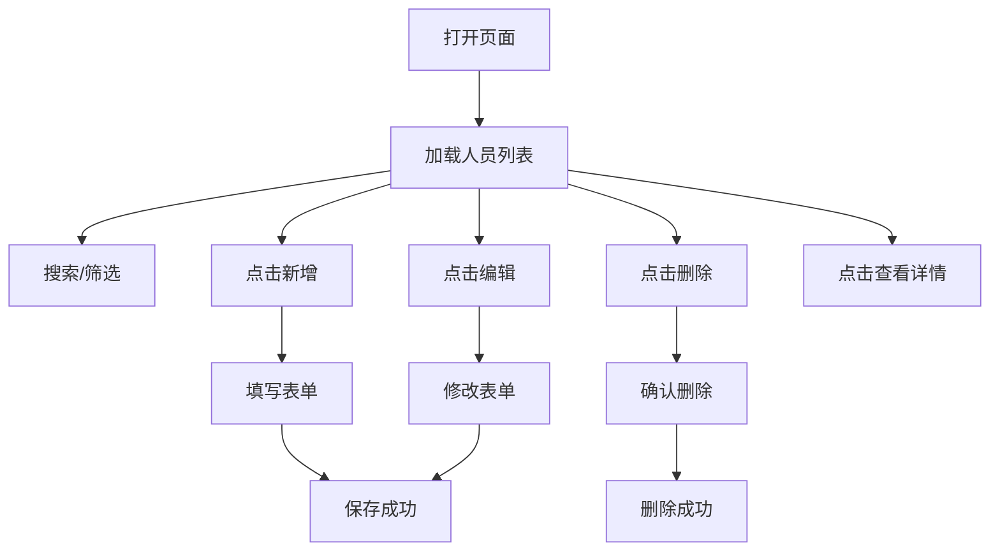

# 人员管理系统产品需求文档

## 1. 产品概述

一个优雅、极简的本地单页人员管理应用，支持对人员信息的增删改查操作。无需后端服务，数据存储于浏览器内存中，适合快速演示与本地管理场景。

## 2. 核心功能

### 2.1 功能模块

1. **人员列表页**：展示所有人员卡片，支持搜索筛选、排序、分页
2. **新增/编辑弹窗**：表单录入与修改人员信息
3. **详情抽屉**：侧滑展示人员详细信息

### 2.2 页面详情

| 页面名称 | 模块名称 | 功能描述 |
|---------|---------|---------|
| 人员列表 | 顶部栏 | 标题、新增按钮、搜索框、统计数字 |
| 人员列表 | 列表区 | 卡片网格布局，展示头像、姓名、职位、部门、联系方式 |
| 人员列表 | 操作区 | 编辑、删除、查看详情按钮 |
| 新增/编辑 | 表单弹窗 | 姓名、性别、职位、部门、手机号、邮箱、入职日期、状态 |
| 详情抽屉 | 信息展示 | 侧滑面板，展示完整人员信息与头像 |

## 3. 核心流程

用户打开页面后，首先看到人员卡片列表。可通过顶部搜索框实时筛选人员，点击"新增人员"按钮弹出表单进行录入，点击卡片上的编辑按钮修改信息，点击删除按钮移除人员，点击卡片查看详情侧滑面板。

## 4. 用户界面设计

### 4.1 设计风格

- **主色调**：深墨蓝 `#1a1f36` 作为标题与强调色，暖米白 `#faf8f5` 作为页面背景
- **辅色**：陶土橙 `#e07a5f` 用于主要按钮与高亮，鼠尾草绿 `#81b29a` 用于成功状态
- **按钮风格**：圆角胶囊形状（border-radius: 999px），悬停时有轻微上浮阴影
- **字体**：标题使用衬线字体 "Playfair Display" 体现优雅感，正文使用无衬线字体 "DM Sans" 保证可读性
- **布局风格**：卡片式网格布局，留白充足，信息层级清晰
- **图标风格**：使用 Lucide 图标，线条简洁，1.5px 描边

### 4.2 页面设计概述

| 页面名称 | 模块名称 | UI 元素 |
|---------|---------|---------|
| 人员列表 | 顶部栏 | 左侧大标题 Playfair Display 32px，右侧搜索框 + 新增按钮 |
| 人员列表 | 统计栏 | 四列数据卡片：总人数、在职、试用期、已离职，数字使用衬线字体 |
| 人员列表 | 卡片网格 | 三列响应式网格，卡片圆角 16px，白色背景，hover 时 y 轴上移 4px + 阴影加深 |
| 人员列表 | 卡片内容 | 顶部头像（姓名首字母渐变背景），姓名 18px 加粗，职位与部门使用灰色次要文字 |
| 人员列表 | 卡片操作 | 底部三个图标按钮：查看、编辑、删除，hover 时背景色变深 |
| 新增/编辑 | 弹窗 | 居中模态框，最大宽度 480px，圆角 20px，表单字段垂直排列，标签左对齐 |
| 详情抽屉 | 侧滑面板 | 右侧滑入，宽度 400px，顶部大头像，下方信息以标签+值的形式展示 |

### 4.3 响应式设计

- **桌面端**：三列卡片网格，侧滑详情面板
- **平板端**：两列卡片网格，弹窗与抽屉保持原有尺寸
- **移动端**：单列卡片列表，搜索框移至标题下方，抽屉变为全屏模态

### 4.4 动效设计

- **页面加载**：卡片依次淡入上浮，stagger delay 50ms
- **hover 效果**：卡片 translateY(-4px) + box-shadow 加深，过渡 200ms ease-out
- **弹窗/抽屉**：进入时 scale(0.95)->scale(1) + opacity 淡入，退出时反向，300ms cubic-bezier(0.4, 0, 0.2, 1)
- **删除确认**：按钮抖动动画提示确认
- **数字变化**：统计数字变化时使用计数动画
