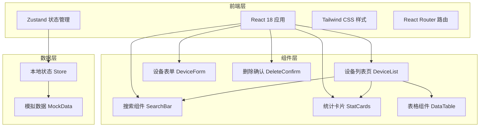
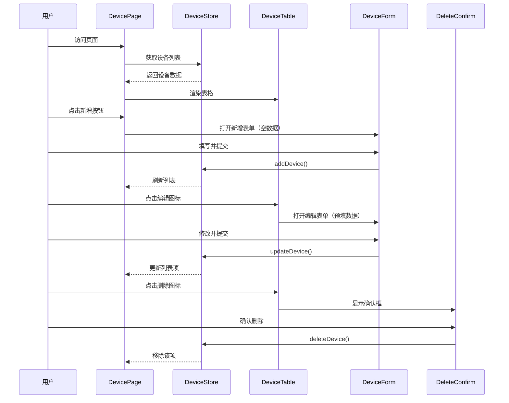

## 1. 架构设计



## 2. 技术选型

- **前端框架**: React@18 + TypeScript
- **构建工具**: Vite
- **样式方案**: Tailwind CSS v3
- **状态管理**: Zustand
- **路由**: React Router DOM
- **图标库**: lucide-react
- **UI 组件**: 自定义组件 + Tailwind 样式
- **初始化工具**: vite-init (react-ts 模板)
- **后端**: 无（纯前端项目，使用模拟数据）

## 3. 路由定义

| 路由路径 | 用途 | 组件 |
|---------|------|------|
| / | 设备管理主页 | DevicePage |
| /devices | 设备列表（别名） | DevicePage |

## 4. API 定义（模拟接口）

由于是纯前端项目，使用模拟数据和本地状态管理替代真实 API。

### 4.1 TypeScript 类型定义

```typescript
// 设备类型枚举
type DeviceType = 'sensor' | 'gateway' | 'controller' | 'camera';

// 设备状态枚举
type DeviceStatus = 'online' | 'offline' | 'maintenance';

// 设备接口
interface Device {
  id: string;
  name: string;
  type: DeviceType;
  status: DeviceStatus;
  ipAddress: string;
  location?: string;
  description?: string;
  createdAt: string;
  updatedAt: string;
}

// 表单数据接口（不含时间戳）
interface DeviceFormData {
  name: string;
  type: DeviceType;
  status: DeviceStatus;
  ipAddress: string;
  location?: string;
  description?: string;
}
```

### 4.2 状态管理 Store 接口

```typescript
interface DeviceStore {
  devices: Device[];
  searchQuery: string;
  currentPage: number;
  pageSize: number;

  // 操作方法
  addDevice: (data: DeviceFormData) => void;
  updateDevice: (id: string, data: DeviceFormData) => void;
  deleteDevice: (id: string) => void;
  setSearchQuery: (query: string) => void;
  setCurrentPage: (page: number) => void;
}
```

## 5. 项目结构

```
src/
├── components/
│   ├── DeviceTable.tsx      # 设备数据表格
│   ├── DeviceForm.tsx       # 新增/编辑设备表单
│   ├── DeleteConfirm.tsx    # 删除确认对话框
│   ├── SearchBar.tsx        # 搜索栏组件
│   ├── StatCards.tsx        # 统计卡片组件
│   └── Pagination.tsx       # 分页组件
├── hooks/
│   └── useDevices.ts        # 设备相关逻辑 hook
├── pages/
│   └── DevicePage.tsx       # 设备管理主页面
├── store/
│   └── deviceStore.ts       # Zustand 状态存储
├── types/
│   └── device.ts            # TypeScript 类型定义
├── data/
│   └── mockData.ts          # 模拟初始数据
├── utils/
│   └── helpers.ts           # 工具函数
├── App.tsx                  # 应用入口
├── main.tsx                 # React 渲染入口
└── index.css                # 全局样式
```

## 6. 组件交互流程



## 7. 初始模拟数据

系统预置 12-15 条设备示例数据，覆盖不同设备类型和状态，用于演示完整功能。
