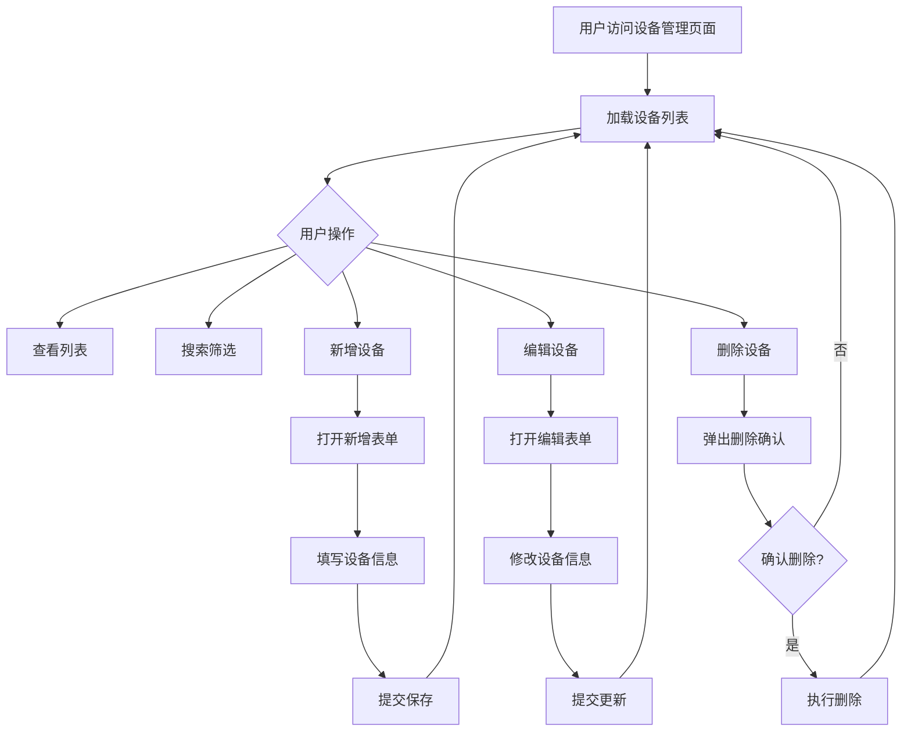

## 1. 产品概述
设备管理系统前端界面 - 提供设备的增删改查(CRUD)功能，用于管理各类设备信息。
- 主要用途：设备信息录入、查询、编辑和删除操作
- 目标用户：系统管理员、设备运维人员

## 2. 核心功能

### 2.1 用户角色
| 角色 | 核心权限 |
|------|----------|
| 管理员 | 设备的增删改查全部操作 |

### 2.2 功能模块
1. **设备列表页面**: 展示所有设备信息，支持搜索、筛选、分页
2. **新增设备弹窗/表单**: 录入新设备信息
3. **编辑设备弹窗/表单**: 修改已有设备信息
4. **删除确认对话框**: 删除设备前的二次确认

### 2.3 页面详情
| 页面名称 | 模块名称 | 功能描述 |
|-----------|-------------|---------------------|
| 设备管理页 | 设备列表 | 表格展示设备数据，支持排序 |
| 设备管理页 | 搜索栏 | 按设备名称、编号搜索 |
| 设备管理页 | 操作按钮 | 新增、编辑、删除按钮 |
| 设备管理页 | 分页组件 | 数据分页展示 |
| 设备管理页 | 新增/编辑表单 | 弹窗式表单，包含设备字段输入 |
| 设备管理页 | 删除确认 | 模态框确认删除操作 |

## 3. 核心流程

### 3.1 用户操作流程
1. 用户进入设备管理页面 → 系统展示设备列表（分页）
2. 用户点击"新增设备"按钮 → 弹出新增表单 → 填写信息 → 提交 → 刷新列表
3. 用户点击"编辑"图标 → 弹出编辑表单（预填数据）→ 修改信息 → 提交 → 更新列表
4. 用户点击"删除"图标 → 弹出确认对话框 → 确认删除 → 从列表移除
5. 用户在搜索框输入关键词 → 实时过滤设备列表

## 4. 用户界面设计

### 4.1 设计风格
- **主色调**: 深蓝色系 (#1e3a5f) + 科技蓝 (#0ea5e9)
- **辅助色**: 浅灰背景 (#f8fafc)、成功绿 (#10b981)、警告红 (#ef4444)
- **按钮样式**: 圆角按钮，带悬停动效和阴影变化
- **字体**: 中文使用思源黑体/Noto Sans SC，英文使用 JetBrains Mono（代码感）
- **布局风格**: 卡片式布局，顶部导航栏 + 主内容区
- **图标风格**: Lucide 图标库，线性图标风格
- **设计方向**: 工业科技风，专业简洁的仪表盘风格

### 4.2 页面设计概览
| 页面名称 | 模块名称 | UI 元素 |
|-----------|-------------|-------------|
| 设备管理页 | 页面标题 | "设备管理"大标题 + 统计卡片(总数/在线/离线) |
| 设备管理页 | 工具栏 | 搜索框 + 新增按钮 + 刷新按钮 |
| 设备管理页 | 数据表格 | 设备ID、设备名称、设备类型、状态、IP地址、创建时间、操作列 |
| 设备管理页 | 新增/编辑弹窗 | 居中模态框，表单字段带标签和校验 |
| 设备管理页 | 删除确认 | 小型居中对话框，红色警告提示 |

### 4.3 响应式设计
- 桌面优先设计，支持移动端适配
- 表格在小屏幕下可横向滚动
- 弹窗在移动端全屏显示

## 5. 设备数据模型

### 5.1 设备字段定义
| 字段名 | 类型 | 必填 | 说明 |
|--------|------|------|------|
| id | string | 是 | 设备唯一标识 (自动生成) |
| name | string | 是 | 设备名称 |
| type | string | 是 | 设备类型 (传感器/网关/控制器/摄像头) |
| status | string | 是 | 在线/离线/维护中 |
| ipAddress | string | 是 | IP 地址 |
| location | string | 否 | 安装位置 |
| description | string | 否 | 备注描述 |
| createdAt | string | 自动 | 创建时间 |
| updatedAt | string | 自动 | 更新时间 |
