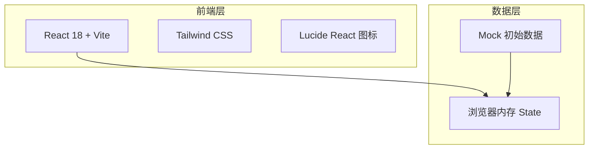

# 人员管理系统技术架构文档

## 1. 架构设计



## 2. 技术描述

- **前端框架**：React 18 + Vite
- **样式方案**：Tailwind CSS
- **图标库**：Lucide React
- **构建工具**：Vite
- **后端**：无
- **数据库**：无，数据存储于 React State（内存中）
- **初始数据**：内置 8 条 mock 人员数据用于演示

## 3. 路由定义

| 路由 | 用途 |
|-----|------|
| / | 人员列表页（唯一页面） |

## 4. 数据模型

### 4.1 数据模型定义

```typescript
interface Person {
  id: string;
  name: string;        // 姓名
  gender: 'male' | 'female'; // 性别
  position: string;    // 职位
  department: string;  // 部门
  phone: string;       // 手机号
  email: string;       // 邮箱
  joinDate: string;    // 入职日期 (YYYY-MM-DD)
  status: 'active' | 'probation' | 'resigned'; // 状态：在职/试用期/已离职
  avatar?: string;     // 头像 URL（可选，默认使用姓名首字母）
}
```

### 4.2 初始数据

内置 8 条不同部门、不同状态的 mock 人员数据，覆盖技术部、产品部、设计部、市场部等常见部门。

## 5. 组件结构

```
App
├── Header              # 顶部标题栏 + 新增按钮
├── StatsBar            # 统计数字卡片
├── SearchBar           # 搜索框
├── PersonGrid
│   └── PersonCard      # 人员卡片
│       └── CardActions # 卡片操作按钮
├── PersonModal         # 新增/编辑弹窗
├── PersonDrawer        # 详情侧滑面板
└── DeleteConfirm       # 删除确认弹窗
```

## 6. 状态管理

使用 React `useState` 进行本地状态管理：

- `persons`: Person[] - 人员列表
- `searchQuery`: string - 搜索关键词
- `selectedPerson`: Person | null - 当前选中人员（详情/编辑）
- `isModalOpen`: boolean - 弹窗开关
- `isDrawerOpen`: boolean - 抽屉开关
- `modalMode`: 'create' | 'edit' - 弹窗模式
- `deleteId`: string | null - 待删除人员 ID

## 7. 交互逻辑

- **搜索**：根据姓名、职位、部门、手机号进行实时模糊匹配
- **排序**：默认按入职日期倒序，可切换为按姓名排序
- **新增**：生成 UUID 作为 id，校验手机号与邮箱格式
- **编辑**：回填表单数据，保存时保留原 id
- **删除**：二次确认后从列表中移除
- **详情**：点击卡片非按钮区域打开右侧抽屉
