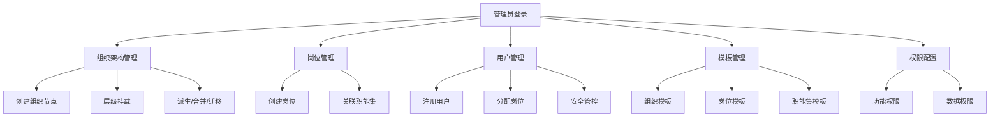

## 1. 产品概述

用户组织域管理系统是企业级用户与组织架构管理平台，提供组织架构、岗位、用户、权限等核心域的全生命周期管理能力。系统支持纵向（集团-分公司-部门）与横向（项目集-项目）双维度组织建模，结合模板化配置与灵活的权限体系，满足大型企业复杂组织管理需求。

- 目标用户：企业HR管理员、系统管理员、组织架构设计师
- 核心价值：标准化组织管理流程、模板化快速部署、精细化权限管控

## 2. 核心功能

### 2.1 用户角色

| 角色 | 核心权限 |
|------|----------|
| 超级管理员 | 全部模块的管理权限，包括组织、岗位、用户、权限、模板等 |
| 组织管理员 | 组织架构管理、岗位管理、用户管理权限 |
| 权限管理员 | 职能集管理、资源管理、权限配置权限 |
| 模板管理员 | 组织架构模板、岗位模板、职能集模板管理权限 |

### 2.2 功能模块

1. **组织架构管理**：组织节点增删改查、层级挂载、停用/启用、派生独立组织、合并、迁移
2. **岗位管理**：岗位增删改查、停用/启用、关联职能集
3. **模板管理**：组织架构模板、岗位模板、职能集模板的版本化管理
4. **用户管理**：用户注册、编辑、锁定/解锁、禁用/启用、注销、改密
5. **安全策略**：密码策略、锁定规则配置
6. **认证管理**：用户登录/登出、认证记录查询
7. **职能集管理**：职能集增删改查、停用/启用
8. **资源管理**：资源树状管理、停用/启用、级联状态更新
9. **权限配置**：平台功能权限、数据权限、应用权限、元模型权限

### 2.3 页面详情

| 页面名称 | 模块名称 | 功能描述 |
|-----------|-------------|---------------------|
| 登录页 | 用户认证 | 账号密码登录、登出功能 |
| 组织架构 | 组织架构管理 | 树形组织展示、节点增删改查、停用启用、派生合并迁移 |
| 岗位管理 | 岗位管理 | 岗位列表、增删改查、停用启用、关联职能集 |
| 用户管理 | 用户管理 | 用户列表、增删改查、锁定解锁、禁用启用、改密重置 |
| 安全策略 | 安全策略 | 密码策略配置、锁定规则配置 |
| 认证记录 | 认证管理 | 登录日志查询、认证状态统计 |
| 职能集管理 | 职能集管理 | 职能集列表、增删改查、停用启用 |
| 资源管理 | 资源管理 | 资源树、增删改查、级联停用启用 |
| 组织模板 | 模板管理 | 组织架构模板CRUD、版本管理、发布停用 |
| 岗位模板 | 模板管理 | 岗位模板CRUD、版本管理、关联职能集模板 |
| 职能集模板 | 模板管理 | 职能集模板CRUD、版本管理、功能/数据权限配置 |
| 平台权限 | 权限配置 | 功能权限配置、数据权限配置 |
| 应用权限 | 权限配置 | 应用功能权限、数据权限、元模型权限 |

## 3. 核心流程

### 3.1 组织架构管理流程
管理员登录 → 进入组织架构页面 → 查看组织树 → 创建/编辑/停用/删除节点 → 操作派生/合并/迁移 → 保存生效

### 3.2 用户管理流程
管理员登录 → 进入用户管理 → 查询用户列表 → 创建/编辑用户 → 分配岗位 → 锁定/禁用/注销 → 改密/重置

### 3.3 模板管理流程
创建模板（草稿）→ 编辑模板内容 → 发布模板（已发布）→ 版本迭代 → 停用/启用 → 删除

### 3.4 权限配置流程
创建职能集 → 配置功能权限 → 配置数据权限 → 关联岗位 → 分配用户

## 4. 用户界面设计

### 4.1 设计风格

- **主色调**：蚂蚁蓝 #1677ff（Ant Design 品牌色），体现专业、可信赖的企业级产品调性
- **辅助色**：成功绿 #52c41a、警告橙 #faad14、错误红 #ff4d4f
- **中性色**：基于灰色系的层级体系，从 #fafafa 到 #000000 共13级灰阶
- **按钮风格**：圆角 6px，主按钮实心底色+白字，次按钮描边+主色字
- **字体**：默认使用 Ant Design 系统字体栈，中文优先 -apple-system、PingFang SC
- **布局风格**：左侧导航 + 顶部面包屑 + 内容区卡片式布局
- **图标风格**：Ant Design Icons 线性图标，统一 16px/14px 尺寸

### 4.2 页面设计概览

| 页面名称 | 模块名称 | UI 元素 |
|-----------|-------------|----------|
| 登录页 | 用户认证 | 品牌Logo、登录表单、记住我、忘记密码、居中卡片布局 |
| 组织架构 | 组织架构管理 | 左侧组织树、右侧详情面板、顶部操作栏、模态框表单 |
| 岗位管理 | 岗位管理 | 搜索筛选栏、数据表格、分页、操作列、详情抽屉 |
| 用户管理 | 用户管理 | 搜索筛选、表格列表、批量操作、用户详情模态框 |
| 安全策略 | 安全策略 | 配置表单、开关组件、滑块/数字输入、规则列表 |
| 认证记录 | 认证管理 | 时间筛选、状态标签、数据表格、统计卡片 |
| 资源管理 | 资源管理 | 树形表格、展开收起、级联操作、右键菜单 |
| 模板列表 | 模板管理 | 卡片/列表视图切换、版本标签、状态徽标、操作菜单 |
| 权限配置 | 权限配置 | 左右分栏、权限树、勾选框、保存重置按钮 |

### 4.3 响应式设计

- 桌面端优先设计，支持 1280px 及以上分辨率
- 左侧导航可折叠收起，适配窄屏显示
- 表格支持横向滚动，保证数据完整性
- 模态框、抽屉组件自适应屏幕尺寸

## 5. 交互特性

### 5.1 组织架构树
- 支持拖拽调整层级（迁移功能）
- 右键菜单快速操作
- 搜索定位高亮节点
- 节点状态用颜色/图标区分（启用/停用/删除）

### 5.2 表格交互
- 行悬停高亮
- 列排序、筛选
- 批量选择与操作
- 行内编辑（部分字段）

### 5.3 表单交互
- 实时校验与错误提示
- 必填字段星号标识
- 提交后loading状态
- 成功/失败消息反馈

### 5.4 状态流转
- 状态变更二次确认
- 操作结果消息提示（Message / Notification）
- 状态标签颜色区分
