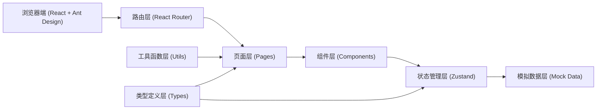

## 1. 架构设计



## 2. 技术描述

- **前端框架**：React 18 + TypeScript
- **UI 组件库**：Ant Design 5.x（蚂蚁金服官方UI框架）
- **图标库**：@ant-design/icons
- **路由管理**：react-router-dom v6
- **状态管理**：Zustand
- **构建工具**：Vite 5
- **样式方案**：Ant Design 内置 CSS-in-JS + 少量自定义样式
- **数据模拟**：前端 Mock 数据 + 状态管理模拟后端交互
- **包管理器**：pnpm

## 3. 路由定义

| 路由路径 | 页面名称 | 说明 |
|----------|----------|------|
| /login | 登录页 | 用户认证入口 |
| / | 首页/仪表盘 | 系统概览、数据统计 |
| /organization | 组织架构 | 组织树管理、节点操作 |
| /position | 岗位管理 | 岗位列表、CRUD、关联职能集 |
| /user | 用户管理 | 用户列表、CRUD、安全管控 |
| /security/policy | 安全策略 | 密码策略、锁定规则配置 |
| /security/audit | 认证记录 | 登录日志、认证审计 |
| /function-set | 职能集管理 | 职能集列表、CRUD |
| /resource | 资源管理 | 资源树、权限资源管理 |
| /template/organization | 组织架构模板 | 模板列表、版本管理 |
| /template/position | 岗位模板 | 模板列表、关联职能集模板 |
| /template/function-set | 职能集模板 | 模板列表、权限配置 |
| /permission/platform | 平台权限配置 | 功能权限、数据权限 |
| /permission/app | 应用权限配置 | 应用功能、数据、元模型权限 |

## 4. 核心数据模型

### 4.1 组织节点 (OrgNode)
```typescript
interface OrgNode {
  id: string;
  tenantId: string;
  code: string;
  name: string;
  parentId: string | null;
  type: 'GROUP' | 'COMPANY' | 'DEPARTMENT' | 'PROGRAM' | 'PROJECT';
  status: 'ACTIVE' | 'INACTIVE' | 'DELETED';
  orgScale?: string;
  businessInfo?: string;
  innerOuter?: 'INNER' | 'OUTER';
  orgType?: 'VERTICAL' | 'HORIZONTAL';
  sort: number;
  createdAt: string;
  updatedAt: string;
}
```

### 4.2 岗位 (Position)
```typescript
interface Position {
  id: string;
  code: string;
  name: string;
  orgNodeId: string;
  status: 'ACTIVE' | 'INACTIVE' | 'DELETED';
  functionSetIds: string[];
  description?: string;
  createdAt: string;
  updatedAt: string;
}
```

### 4.3 用户 (User)
```typescript
interface User {
  id: string;
  code: string;
  username: string;
  name: string;
  positionIds: string[];
  orgNodeId: string;
  status: 'NORMAL' | 'LOCKED' | 'DISABLED' | 'CANCELLED' | 'DELETED';
  email?: string;
  phone?: string;
  lockReason?: string;
  lockTime?: string;
  createdAt: string;
  updatedAt: string;
}
```

### 4.4 职能集 (FunctionSet)
```typescript
interface FunctionSet {
  id: string;
  code: string;
  name: string;
  status: 'ACTIVE' | 'INACTIVE' | 'DELETED';
  description?: string;
  resourceIds: string[];
  dataPermission?: DataPermissionConfig;
  createdAt: string;
  updatedAt: string;
}
```

### 4.5 模板基础 (BaseTemplate)
```typescript
interface BaseTemplate {
  id: string;
  code: string;
  name: string;
  version: string;
  versionNo: number;
  status: 'DRAFT' | 'PUBLISHED' | 'INACTIVE' | 'DELETED';
  type: 'ORG' | 'POSITION' | 'FUNCTION_SET';
  parentVersionId?: string;
  content: Record<string, any>;
  createdAt: string;
  updatedAt: string;
}
```

### 4.6 资源 (Resource)
```typescript
interface Resource {
  id: string;
  code: string;
  name: string;
  parentId: string | null;
  type: 'MENU' | 'BUTTON' | 'API' | 'DATA';
  status: 'ACTIVE' | 'INACTIVE' | 'DELETED';
  path?: string;
  icon?: string;
  sort: number;
  children?: Resource[];
}
```

### 4.7 安全策略 (SecurityPolicy)
```typescript
interface PasswordPolicy {
  id: string;
  name: string;
  minLength: number;
  maxLength: number;
  requireUpper: boolean;
  requireLower: boolean;
  requireNumber: boolean;
  requireSpecial: boolean;
  includeUsername: boolean;
  noConsecutiveLetters: boolean;
  noConsecutiveNumbers: boolean;
  status: 'ACTIVE' | 'INACTIVE';
}

interface LockRule {
  id: string;
  name: string;
  failThreshold: number;
  lockDuration: number;
  lockUnit: 'MINUTE' | 'HOUR' | 'DAY';
  status: 'ACTIVE' | 'INACTIVE';
}
```

### 4.8 认证记录 (AuthLog)
```typescript
interface AuthLog {
  id: string;
  userId: string;
  username: string;
  type: 'LOGIN' | 'LOGOUT';
  status: 'SUCCESS' | 'FAIL';
  ip: string;
  userAgent: string;
  failReason?: string;
  createdAt: string;
}
```

## 5. 目录结构

```
src/
├── components/          # 公共组件
│   ├── PageContainer/   # 页面容器
│   ├── StatusTag/       # 状态标签
│   └── TableToolbar/    # 表格工具栏
├── pages/               # 页面组件
│   ├── Login/           # 登录页
│   ├── Dashboard/       # 仪表盘
│   ├── Organization/    # 组织架构
│   ├── Position/        # 岗位管理
│   ├── User/            # 用户管理
│   ├── Security/        # 安全策略 & 认证记录
│   ├── FunctionSet/     # 职能集管理
│   ├── Resource/        # 资源管理
│   ├── Template/        # 模板管理
│   └── Permission/      # 权限配置
├── store/               # 状态管理
│   ├── orgStore.ts
│   ├── userStore.ts
│   ├── positionStore.ts
│   └── ...
├── mock/                # 模拟数据
│   ├── orgData.ts
│   ├── userData.ts
│   └── ...
├── types/               # 类型定义
│   └── index.ts
├── utils/               # 工具函数
│   ├── idGenerator.ts
│   └── ...
├── layouts/             # 布局组件
│   └── MainLayout.tsx
├── router/              # 路由配置
│   └── index.tsx
├── App.tsx
├── main.tsx
└── index.css
```

## 6. 组件拆分原则

- 每个页面主组件不超过 300 行
- 复杂页面拆分为：列表组件、表单组件、详情组件
- 可复用的业务组件提取到 components 目录
- 表格操作栏、状态展示等通用模式封装为公共组件
